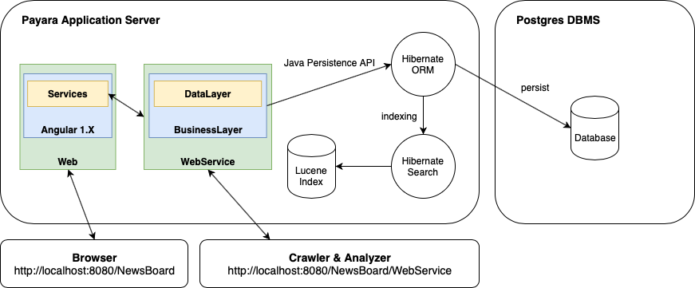

# Newsboard [](http://git01-ifm-min.ad.fh-bielefeld.de/Forschung/sw-lab/ki-newsboard/2016_10_Modulares_WebNewsboard/commits/master)


Das Newsboard ist ein modulares webbasiertes System zur Anzeige von Newsbeiträgen aus diversen Quellen. Crawler können dazu über eine REST-Schnittstele neue Newsbeiträge anliefern und Analyzer Newsbeiträge abrufen um diese einer Sentiment-Analyse zu unterziehen. Angezeigt werden die Newsbeiträge und die Analyseergebnisse in einer Weboberfläche. 

Diese Dokumentation ist in die Abschnitte [Crawler und Analyzer Entwicklung](#crawler-und-analyzer-entwicklung) und [Newsboard Entwicklung](#newsboard-entwicklung) gegliedert. Der erste Abschnitt richtet sich dabei an die Studenten die eigene Crawler bzw. Analyzer an das Newsboard anbinden möchten. Der zweite Abschnitt beschreibt die Architektur und das Build-System des Newsboard und ist für zukünftige Weiterentwicklungen am Newsboard interessant.

## Crawler und Analyzer Entwicklung
Für die Entwicklung eines eigenen Crawlers oder Analyzers, ist es zunächst notwendig das Newsboard lokal auszuführen. Anschließend kann die REST-Schnittstelle des Newsboard verwendet werden, um Newsbeiträge zu veröffentlichen oder für die Sentiment-Analyse abzurufen.

### Newsboard ausführen
Das Newsboard besteht aus einer Postgresql Datenbank und einer Webapplikation. Um die Entwicklung eines Crawler bzw. Analyzer zu vereinfachen, wird zu diesem Zweck das Newsboard über einer Docker-Compose Konfiguration eingerichtet. Daher ist es zwingend notwendig das docker und docker-compose auf dem Entwicklungssystem bereits installiert sind.

[Docker Compose Installation](https://docs.docker.com/compose/install/)

Anschließend kann das Newsboard über die folgende Scripte gesteuert werden.

* `./newsboard.start.sh` erzeugt (falls noch nicht vorhanden) die nötigen Docker-Images und startet das Newsboard 
* `./newsboard.stop.sh` stoppt alle Docker-Container und damit das Newsboard
* `./newsboard.teardown.sh` stoppt alle Docker-Container und löscht alle erzeugten Images 

Das Start-Skript erzeugt im letzten Schritt folgende Ausgabe. Diese Informationen können für den Zugriff auf das Newsboard und die Implementierung eigener Crawler und Analyzer verwendet werden.

```bash
-----------------------------------------------------
Crawler Token: f6rm4jdanwbb5isbeljs4c
Analyzer Token: 9br4uu4dlm985qced7tzwj
Newsboard API Base: http://localhost:8080/NewsBoard/WebService

Newsboard URL: http://localhost:8080/NewsBoard
-----------------------------------------------------
```

* **Crawler & Analyzer Token** werden zur Authentifizierung an der REST-Schnittstelle verwendet
* **Newsboard API Base** Basis URL der REST-Schnittstelle
* **Newsboard URL** Diese URL kann im Browser geöffnet werden, um die Newsbeiträge und die Analyseergebnisse einzusehen

### REST-Schnittstelle
Die Interaktion mit dem Newsboard erfolgt über die REST-Schnittstelle, die unter der oben beschrieben `Newsboard API Base` zu erreichen ist. Wie die folgenden Beispiele zeigen, erfolgt die Übertragung der Objekte im JSON-Format.  Für die Beispiele wird [cURL](https://curl.haxx.se) und die API Base `http://localhost:8080/NewsBoard/WebService` verwendet. Alternativ kann auch`docs/newsboard.postman_collection.json` in Postman importiert werden, um die Beispiel in Postman zu betrachten.

#### Crawler
Die Ressourcen für den Crawler sind unter der `Newsboard API Base` + `/crawler` zu erreichen. Diese URL ist lediglich die erweiterte API Base für den Crawler und wird wie folgt um die gewünschte Ressource erweitert. Für die Authentifizierung des Crawlers muss der `token` im HTTP-Header gesetzt werden.

##### Newsbeitrag veröffentlichen
Das Veröffentlichen von Newsbeiträgen erfolgt mittels HTTP-POST über die Ressource `/news`. Der HTTP-Body beinhaltet dabei den Newsbeitrag im JSON-Format und folgende Struktur. 

```javascript
{
    "id": "test-id",                // Pflichtfeld: Eindeutiger String mit 3-255 Zeichen
    "title": "News Title",          // Optional: String mit max. 1024 Zeichen
    "image": "Image URL",           // Optional: URL zur Image ressource
    "excerpt": "Zusammenfassung",   // Optional: String mit max. 1024 Zeichen
    "content": "Inhalt",            // Pflichtfeld: String mit max. 10485760 Zeichen
    "source": "Quelle",             // Pflichtfeld: String mit 3-255 Zeichen
    "url": "Link Newsbeitrag",      // Pflichtfeld: String mit 10-512 Zeichen
    "date": "Datum"                 // Pflichtfeld: Datum im ISO 8601 Format yyyy-mm-ddThh:mm:ssZ 
}
```

Mit folgendem `cURL`-Aufruf auf der Konsole, kann beispielhaft ein Newsbeitrag veröffentlicht werden.

```bash
curl -H "Content-Type: application/json" \
     -H "token: f6rm4jdanwbb5isbeljs4c" \
     -X POST \
     -d '{"id": "test-id", "title": "Test Title", "content": "Test Inhalt", "source": "test", "url": "http://heise.de", "date": "2019-02-12T23:52:00Z" }' \
     -s \
     http://localhost:8080/NewsBoard/WebService/crawler/news
```

#### Analyzer
Die Ressourcen für den Analyzer sind unter der `Newsboard API Base` + `/analyzer` zu erreichen. Diese URL ist lediglich die erweiterte API Base für den Analyzer und wird wie folgt um die gewünschte Ressource erweitert. Für die Authentifizierung des Analyzers muss der `token` im HTTP-Header gesetzt werden.

##### Newsbeiträge abrufen
Das Abrufen von noch nicht analysierten Newsbeiträgen erfolgt mittels HTTP-GET über die Ressource `/news`. Mit dem folgenden `cURL`-Aufruf auf der Konsole können beispielhaft alle noch nicht analysierten Newsbeiträge abgerufen werden.

```bash
curl -H "Content-Type: application/json" \
     -H "token: 9br4uu4dlm985qced7tzwj" \
     -X GET \
     -s \
     http://localhost:8080/NewsBoard/WebService/analyzer/news
```

Zurückgeliefert wird ein Array im JSON-Format mit dem Aufbau identisch zum veröffentlichtem Newsbeitrag.

```javascript
[
    {
        "content": "Test Inhalt",
        "date": "2019-02-12T23:52:00Z",
        "excerpt": "Test Zusammenfassung",
        "id": "test-id",
        "image": "http://placehold.it/500x500",
        "source": "heise",
        "title": "Test Title",
        "url": "http://heise.de"
    },
    ...
]
```

##### Analyseergebnis veröffentlichen
Das Veröffentlichen von Analyseergebnissen zu Newsbeiträgen erfolgt mittels HTTP-POST über die Ressource `/news`. Dabei muss zusätzlich die Id des Newsbeitrags, dessen Analyseergebnis veröffentlicht werden soll, in der Ressource übergeben werden. Der HTTP-Body beinhaltet dabei den Newsbeitrag im JSON-Format und folgende Struktur. 

```javascript
{
    "date": "2019-02-12T23:52:00Z",     // Pflichtfeld: Datum im ISO 8601 Format yyyy-mm-ddThh:mm:ssZ 
    "value": 10,                        // Pflichtfeld: Bewertung von -100 bis +100
    "sentenceResults": [{               // Optional: Analyse auf Satz-Ebene
    	"charStart": 0,                 // Pflichtfeld: String-Index Satz Start
    	"charEnd": 3,                   // Pflichtfeld: String-Index Satz Ende
    	"value": 5                      // Pflichtfeld: Bewertung von -100 bis +100
    }]
}
```

Mit folgendem `cURL`-Aufruf auf der Konsole, kann beispielhaft ein Analyseergebnis veröffentlicht werden.

```bash
curl -H "Content-Type: application/json" \
     -H "token: 9br4uu4dlm985qced7tzwj" \
     -X POST \
     -d '{ "date": "2019-02-12T23:52:00Z", "value": 10, "sentenceResults": [{ "charStart": 0, "charEnd": 3, "value": 5 }] }' \
     -s \
     http://localhost:8080/NewsBoard/WebService/analyzer/news/test-id
```

#### Client Bibliotheken
In dem Verzeichnis `libs/` im Newsboard Hauptverzeichnis, existieren bereits für folgende Programmiersprachen Client Bibliotheken, die den Zugriff auf die REST-Schnittstelle kapseln und somit eine transparente Interaktion mit der Newsboard API ermöglichen. Diese Bibliotheken können bei der Implementierung eines Crawler bzw. Analyzers verwendet werden, um Newsbeiträge zu veröffentlichen und für die Sentiment-Analyse abzurufen.

* `libs/js/` Javascript Client Bibliothek als NPM Paket. Weitere Informationen: [Javascript](libs/js/) 
* `libs/python` Python Client Bibliothek. Weitere Informationen: [Python](libs/python/)

### Beispiele
Als weitere Quelle für Informationen bei der Implementierung eigener Crawler und Analyzer, können die Beispiele im Verzeichnis `Examples/` herangezogen werden. 

* **RSSCrawler** Implementierung eines Crawlers in Javascript der RSS Feeds scannt und im Newsboard veröffentlicht.
* **RandomAnalyzer** Beispielhafte Implementierung eines Analyzers in Javascript der Newsbeiträge vom Newsboard abruft und zufällig bewertet.
* **TwitterCrawler** Implementierung eines Crawler in Python der Tweets mit bestimmten Schlüsselwörtern auf Twitter sucht und diese im Newsboard veröffentlicht.
* **BingSerarchCrawler** Implementierung eines Crawlers in Javascript der die Bing Search API nutzt und Suchergebnisse im Newsboard veröffentlicht. 

## Newsboard Entwicklung
Das Newsboard ist als mehrschichtige Java-EE Applikation implementiert und wird in einem Web- und EJB-Container auf einem Java-EE Server ausgeführt. In dem Docker Container wird Payara als Java-EE Server eingesetzt, der jedoch gegen einen beliebigen Java-EE Server ausgetauscht werden kann.

### Architektur

#### DataLayer
Für die persistente Speicherung der anfallenden Daten wird die *Java Persistence API* (JPA) der Java EE Platform verwendet. Die Spezifikation der API ist in [JSR 338](http://jcp.org/en/jsr/detail?id=338) zu finden. Alle zu mappenden Objekte werden in dieser Schicht der Applikation definiert und das Schema über entsprechende Annotationen beschrieben. 

Als JPA Provider kommt [Hibernate ORM](http://hibernate.org/orm/) zum Einsatz und kann über die `resources/META-INF/persistence.xml` ausgetauscht werden. In Kombination mit [Hibernate Search](http://hibernate.org/search/) wird die transparente Indizierung der Daten mit [Apache Lucene](http://lucene.apache.org) vorgenommen. Dieser Index wird in den darüber liegenden Schichten für diverse Suchvorgänge und das Ranking von Ergebnissen verwendet. 

Der Java Database Connection Pool (JDBC) wird auf dem Java EE Server konfiguriert und verwaltet. Über die Eigenschaft `jta-data-source` in der `resources/META-INF/persistence.xml` wird dem Newsboard mitgeteilt, welcher JDBC-Pool verwendet werden soll. Somit sind keine Datenbank Verbindungszeichenfolgen im Projekt Quellcode enthalten und das Newsboard kann ohne Anpassungen auf verschiedenen System deployed werden.

#### BusinessLayer
In dieser Schicht der Applikation ist die Geschäftslogik des Newsboard implementiert. Die Geschäftslogik ist in folgende Use-Case bezogene Services untergliedert, die mittels *Enterprise Java Bean* (EJB) der Java EE Platform, den darüberliegenden Schichten bereitgestellt werden. Die Spezifikation zu EJB ist in [JSR 345](http://jcp.org/en/jsr/detail?id=345) definiert.

* **NewsBoardService** wird als `Stateless` EJB registriert und enthält die Geschäftslogik für das Frontend.
* **AdminService** wird als `Stateless` EJB registriert und enthält die Geschäftslogik für die Administrationsoberfläche.
* **AuthenticationService** wird als `Singleton` EJB registriert und enthält die Geschäftslogik für die Authentifizierung in der Administrationsoberfläche. Hierzu wird der [SCL Usermanager-WebService](http://scl2-ifm-min.ad.fh-bielefeld.de:8080/SCL_Usermanager/UserWebService?wsdl) verwendet um sich mittels LDAP zu authentifizieren.
* **LuceneStartupService** wird als `Singleton` EJB registriert und mittels der `Startup`-Annotation beim Start der Applikation ausgeführt, um alle Datenbank Einträge im Apache Lucene Index zu indizieren.

Der *EntityManager* für den Zugriff auf die persistenten Daten, wird mittels der *PersistenceContext*-Annotation vom Java EE Server bei der Erzeugung der EJBs injiziert. Die Eigenschaft Unit-Name der Annotation verweist dabei auf die zu verwendende Persistence Unit aus der `resources/META-INF/persistence.xml` der DataLayer-Schicht.

```java
@Stateless
public class NewsBoardService {
    //...
    @PersistenceContext(name = "NewsBoardPU")
    private EntityManager entityManager;
    //...
}
```

#### WebService
Alle Funktionalitäten des Newsboard werden über den WebService nach außen bereitgestellt. Der WebService wird mit der *Java API for RESTful Web Services (JAX-RS)* der Java EE Platform implementiert und wird in [JSR 370](http://jcp.org/en/jsr/detail?id=370) näher spezifiziert. 

Die Newsboard REST-Schnittstelle wird als Ressourcen-orientierte Schnittstelle implementiert und teilt sich wie folgt auf.

* **/WebService/backend** beinhaltet alle für die Administrationsoberfläche relevanten Ressourcen. Nach erfolgreicher Authentifizierung durch die `AuthResource`, muss der zurückgelieferte Token in jedem HTTP-Request für die `/backend` Ressourcen im Header übertragen werden.
* **/WebService/frontend** beinhaltet die Ressourcen die für das Frontend relevant sind.
* **/WebService/crawler** und **/WebService/analyzer** beinhalten die für die Crawler bzw. Analyzer relevanten Ressourcen. Der in der Administrationsoberfläche beim Anlegen der Crawler/Analyzer definierte Token, muss im Header der HTTP-Requests angegeben werden.

Der WebService verwendet die im [BusinessLayer](#businesslayer) registrierten EJBs für die Create-, Read-, Update- und Delete- (CRUD) Operationen. Diese werden wie folgt mit der EJB-Annotation durch Java-EE Server in die Ressourcen injiziert.

```java
@Path("/news")
@Produces(MediaType.APPLICATION_JSON)
public class NewsResource {
    @EJB
    private NewsBoardService newsBoardService;
    //...
}
```

Die Übertragung der Daten erfolgt mittels der *Java API for JSON Processing 1.1* ([JSR 374](http://jcp.org/en/jsr/detail?id=374)) durch den Java-EE Server. Zusätzlich wird die *Java API for JSON Binding 1.0* ([JSR 367](http://jcp.org/en/jsr/detail?id=367)) verwendet, um die in dieser Schicht definierten Daten-Transfer-Objekte (DTO) zu JSON zu serialisieren bzw. aus JSON zu de-serialisieren.  Die DTO's kapseln die im *DataLayer* definierten POJO's und stellen wie im folgenden Beispiel nur die für den aktuellen HTTP-Request relevanten Eigenschaften bereit. 

```java

@Path("/news")
@Produces(MediaType.APPLICATION_JSON)
public class NewsResource {
    //...
    @POST
    public Response publish(@Valid NewsEntryBaseModel model) {
        //...
    }
    //...
```

Die Validierung der DTO's erfolgt wie folgt, mit der *Bean Validation API* die in [JSR 380](http://jcp.org/en/jsr/detail?id=380) spezifiziert wird. Diese ermöglicht eine transparente Validierung der *HTTP-Requests* durch die `@Valid`-Annotation am Request-Parameter und weiterer Annotation im DTO.

```java
public class NewsEntryBaseModel {
    //...
    @NotNull
    @Size(min = 3, max = 255)
    public String getId() {
        return id;
    }
    //...
}
```

#### Web
Das Web-Projekt liegt parallel zum WebService und ist Single Page Applikation (SPA) implementiert. Dabei wird beim ersten Aufruf der Weboberfläche die Applikation zum Client übertragen und der WebService für den Zugriff auf die Daten verwendet. Für die Implementierung der SPA wird das AngularJS 1 Framework verwendet und besteht aus folgenden Teil-Applikationen.

* **/NewsBoard** zeigt eine Übersicht aller Newsbeiträge und eine Detailansicht zu einem einzelnen Newsbeitrag an. Darüber hinaus wird für eine öffentliche Ansicht ohne Interaktionmöglichkeit, ein Karussell der Newsbeiträge angezeigt, die in definierten Zeitabständen über die letzten 20 Newsbeiträge iteriert.
* **/NewsBoard/admin** implementiert die Administrationsoberfläche zum Verwalten der Crawler/Analyzer und Einschränken der im Frontend angezeigten Newsbeiträge.

Für die Auflösung der Javascript Abhängigkeiten, wird Paketmanagement Tool *Bower* eingesetzt und als statischer Inhalt über den Java EE Server ausgeliefert.

### Build-Prozess
Um automatisierte Builds zu ermöglichen, erfolgt der Build-Prozess losgelöst von jeglicher IDE. Anschließend an den Build-Prozess werden automatisierte Unit- und Integration-Test durchgeführt. Für die Automatisierung wird Gradle als Build-System eingesetzt.

#### Gradle
Das Newsboard ist als Multi-Project Build, bestehend aus dem Root-Projekt (`./build.gradle`) und den in der [Architektur](#architektur) beschriebenen Teilprojekten, konfiguriert. Das auflösen der Abhängigkeiten erfolgt über das *Maven Central repository* und der auf Teilprojekt-Ebene definierten Abhängigkeiten. Je nach Teilprojekt-Typ wird das Build-Ergebnis in einer JAR oder WAR gebündelt, während das Hauptprojekt als EAR zum Deployment auf dem Java-EE Server archiviert wird.

Mit dem Befehl `./gradlew ensamble` kann das Projekt kompiliert und mit `./gradlew check` die Unit- und Integrationstest ausgeführt werden. Die Build- und Test-Ergebnisse werden im Verzeichnis `build/libs/NewsBoard.ear` und `{SUBPROJECT}/build/test-results/` abgelegt.

Um das Teilprojekt Web zum kompilieren, wird auf dem Entwicklungsrechner Nodejs und *Bower* (`npm install -g bower`) benötigt. Für die restlichen Teilprojekte ist das Java Development Kit (JDK) in Version 8 erforderlich.

#### GitLab CI
Die Continuous Integration (CI) mit GitLab wird über die `.gitlab-ci.yml`-Datei im Hauptverzeichnis konfiguriert. Hierzu wird der Docker-[Executor](https://docs.gitlab.com/runner/executors/) mit dem Image `localhost:5000/java-nodejs` aus dem privaten Container Registry verwendet. Das Image enthält alle benötigte Laufzeiten um das Newsboard zu bauen und zu testen. Die CI-Pipeline verwendet für den Build- und Test-Vorgang weiterhin [Gradle](#gradle) und besteht aus folgende Stufen.

* **build** wird nach jedem commit auf allen Branches ausgeführt und erzeugt das `NewsBoard.ear` Archiv.
* **test** wird nach jedem commit auf allen Branches ausgeführt und führt die Unit- und Integrations-Test aus.
* **deploy_staging** wird nur auf dem `master`-Branch nach einem commit ausgeführt und liefert automatisiert das `NewsBoard.ear`-Archiv auf die Testumgebung aus.
* **deploy_production** wird nur manuell auf dem `master`-Branch ausgeführt und liefert das `NewsBoard.ear`-Archiv auf die Produktionsumgebung aus.

Die Build- und Test-Ergebnisse werden nach jeder Stufe als Artefakte ins GitLab übernommen und können dort in der CI/CD Pipeline betrachtet werden.

#### Docker
Um die Einrichtung der Build- und Deployment-Umgebung für das NewsBoard zu vereinfachen, werden über die `docker-compose.yml` folgende Docker Container eingerichtet. 

* **newsboard.cli** basiert auf `/buildtools/cli.dockerfile` und enthält das JDK 8, NodeJS 9.x und Python 3 (inkl. pip) für die Build-Umgebung. Dem Container wird das Hauptverzeichnis vom Newsboard als Volume eingebunden und als Working-Directory gesetzt. Mittels `docker exec newsboard.cli COMMANDS` können nun Befehle ausgeführt werden wie `./gradlew assemble` die im Kontext des Hauptverzeichnis im Container ausgeführt werden.
* **newsboard.payara** basiert auf [payara/server-full:5.183](https://github.com/payara/docker-payaraserver-full/blob/5.183/Dockerfile) und wird als Java-EE Server für das Deployment-Ziel des NewsBoard verwendet. 
* **newsboard.db** basiert auf [postgres](https://github.com/docker-library/postgres/blob/7e80419825e4bab4e749bc61334570ffc261ea5e/11/Dockerfile) und wird vom Java-EE Server und NewsBoard als Datenbank genutzt.

Folgende Skripte nutzen die beschriebenen Container um den Build-, Test- und Deployment- Vorgang weiter zu automatisieren.

* `./newsboard.start.sh` erzeugt die nötigen Docker-Images und startet das Newsboard 
* `./newsboard.check.sh` baut das Newsboard Projekt und führt die Unit- und Integrations-Test aus
* `./newsboard.cli.sh` startet den CLI container und stellt eine Konsole bereit
* `./newsboard.stop.sh` stoppt alle Docker-Container und damit das Newsboard
* `./newsboard.teardown.sh` stoppt alle Docker-Container und löscht alle erzeugten Container und Images