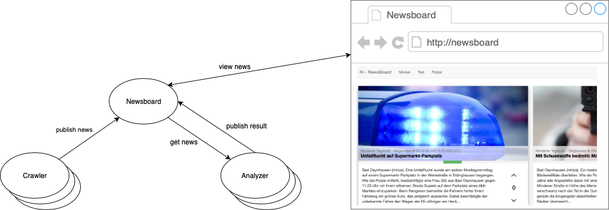

# Newsboard [](http://git01-ifm-min.ad.fh-bielefeld.de/Forschung/sw-lab/ki-newsboard/2016_10_Modulares_WebNewsboard/commits/master)



Das Newsboard ist ein modulares webbasiertes System zur Anzeige von Newsbeiträgen aus diversen Quellen. Crawler können dazu über eine REST-Schnittstele neue Newsbeiträge anliefern und Analyzer Newsbeiträge abrufen um diese einer Sentiment-Analyse zu unterziehen. Angezeigt werden die Newsbeiträge und die Analyseergebnisse in einer Weboberfläche. 

Diese Dokumentation ist in die Abschnitte *Crawler und Analyzer Entwicklung* und *Newsboard Entwicklung* gegliedert. Der erste Abschnitt richtet sich dabei an die Studenten die eigene Crawler bzw. Analyzer an das Newsboard anbinden möchten. Der zweite Abschnitt beschreibt die Architektur und das Build-System des Newsboard und ist für zukünftige Weiterentwicklungen am Newsboard interessant.

## Crawler und Analyzer Entwicklung
Für die Entwicklung eines eigenen Crawlers oder Analyzers, ist es zunächst notwendig das Newsboard lokal auszuführen. Anschließend kann die REST-Schnittstelle des Newsboard verwendet werden, um Newsbeiträge zu veröffentlichen oder für die Sentiment-Analyse abzurufen.

### Newsboard ausführen
Das Newsboard besteht aus einer Postgresql Datenbank und einer Webapplikation. Um die Entwicklung eines Crawler bzw. Analyzer zu vereinfachen, wird zu diesem Zweck das Newsboard über einer Docker-Compose Konfiguration eingerichtet. Daher ist es zwingend notwendig das docker und docker-compose auf dem Entwicklungssystem bereits installiert sind.

[Docker Compose Installation](https://docs.docker.com/compose/install/)

Anschließend kann das Newsboard über die folgende Scripte gesteuert werden.

* `./newsboard.start.sh` erzeugt (falls noch nicht vorhanden) die nötigen Docker-Images und startet das Newsboard 
* `./newsboard.stop.sh` stoppt die Docker-Container und damit das Newsboard
* `./newsboard.teardown.sh` stoppt die Docker-Container und löscht alle erzeugten Images 

Das Start-Skript erzeugt im letzten Schritt folgende Ausgabe. Diese Informationen können für den Zugriff auf das Newsboard und die Implementierung eigener Crawler und Analyzer verwendet werden.

```bash
-----------------------------------------------------
Crawler Token: f6rm4jdanwbb5isbeljs4c
Analyzer Token: 9br4uu4dlm985qced7tzwj
Newsboard API Base: http://localhost:8080/NewsBoard/WebService

Newsboard URL: http://localhost:8080/NewsBoard
-----------------------------------------------------
```

* **Crawler & Analyzer Token** werden zur Authentifizierung an der REST-Schnittstelle verwendet
* **Newsboard API Base** Basis URL der REST-Schnittstelle
* **Newsboard URL** Diese URL kann im Browser geöffnet werden, um die Newsbeiträge und die Analyseergebnisse einzusehen

### REST-Schnittstelle
Die Interaktion mit dem Newsboard erfolgt über die REST-Schnittstelle, die unter der oben beschrieben `Newsboard API Base` zu erreichen ist. Wie die folgenden Beispiele zeigen, erfolgt die Übertragung der Objekte im JSON-Format.  Für die Beispiele wird [cURL](https://curl.haxx.se) und die API Base `http://localhost:8080/NewsBoard/WebService` verwendet. Alternativ kann auch`docs/newsboard.postman_collection.json` in Postman importiert werden, um die Beispiel in Postman zu betrachten.

#### Crawler
Die Ressourcen für den Crawler sind unter der `Newsboard API Base` + `/crawler` zu erreichen. Diese URL ist lediglich die erweiterte API Base für den Crawler und wird wie folgt um die gewünschte Ressource erweitert. Für die Authentifizierung des Crawlers muss der `token` im HTTP-Header gesetzt werden.

##### Newsbeitrag veröffentlichen
Das Veröffentlichen von Newsbeiträgen erfolgt mittels HTTP-POST über die Ressource `/news`. Der HTTP-Body beinhaltet dabei den Newsbeitrag im JSON-Format und folgende Struktur. 

```javascript
{
    "id": "test-id",                // Pflichtfeld: Eindeutiger String mit 3-255 Zeichen
    "title": "News Title",          // Optional: String mit max. 1024 Zeichen
    "image": "Image URL",           // Optional: URL zur Image ressource
    "excerpt": "Zusammenfassung",   // Optional: String mit max. 1024 Zeichen
    "content": "Inhalt",            // Pflichtfeld: String mit max. 10485760 Zeichen
    "source": "Quelle",             // Pflichtfeld: String mit 3-255 Zeichen
    "url": "Link Newsbeitrag",      // Pflichtfeld: String mit 10-512 Zeichen
    "date": "Datum"                 // Pflichtfeld: Datum im ISO 8601 Format yyyy-mm-ddThh:mm:ssZ 
}
```

Mit folgendem `cURL`-Aufruf auf der Konsole, kann beispielhaft ein Newsbeitrag veröffentlicht werden.

```bash
curl -H "Content-Type: application/json" \
     -H "token: f6rm4jdanwbb5isbeljs4c" \
     -X POST \
     -d '{"id": "test-id", "title": "Test Title", "content": "Test Inhalt", "source": "test", "url": "http://heise.de", "date": "2019-02-12T23:52:00Z" }' \
     -s \
     http://localhost:8080/NewsBoard/WebService/crawler/news
```

#### Analyzer
Die Ressourcen für den Analyzer sind unter der `Newsboard API Base` + `/analyzer` zu erreichen. Diese URL ist lediglich die erweiterte API Base für den Analyzer und wird wie folgt um die gewünschte Ressource erweitert. Für die Authentifizierung des Analyzers muss der `token` im HTTP-Header gesetzt werden.

##### Newsbeiträge abrufen
Das Abrufen von noch nicht analysierten Newsbeiträgen erfolgt mittels HTTP-GET über die Ressource `/news`. Mit dem folgenden `cURL`-Aufruf auf der Konsole können beispielhaft alle noch nicht analysierten Newsbeiträge abgerufen werden.

```bash
curl -H "Content-Type: application/json" \
     -H "token: 9br4uu4dlm985qced7tzwj" \
     -X GET \
     -s \
     http://localhost:8080/NewsBoard/WebService/analyzer/news
```

Zurückgeliefert wird ein Array im JSON-Format mit dem Aufbau identisch zum veröffentlichtem Newsbeitrag.

```javascript
[
    {
        "content": "Test Inhalt",
        "date": "2019-02-12T23:52:00Z",
        "excerpt": "Test Zusammenfassung",
        "id": "test-id",
        "image": "http://placehold.it/500x500",
        "source": "heise",
        "title": "Test Title",
        "url": "http://heise.de"
    },
    ...
]
```

##### Analyseergebnis veröffentlichen
Das Veröffentlichen von Analyseergebnissen zu Newsbeiträgen erfolgt mittels HTTP-POST über die Ressource `/news`. Dabei muss zusätzlich die Id des Newsbeitrags, dessen Analyseergebnis veröffentlicht werden soll, in der Ressource übergeben werden. Der HTTP-Body beinhaltet dabei den Newsbeitrag im JSON-Format und folgende Struktur. 

```javascript
{
    "date": "2019-02-12T23:52:00Z",     // Pflichtfeld: Datum im ISO 8601 Format yyyy-mm-ddThh:mm:ssZ 
    "value": 10,                        // Pflichtfeld: Bewertung von -100 bis +100
    "sentenceResults": [{               // Optional: Analyse auf Satz-Ebene
    	"charStart": 0,                 // Pflichtfeld: String-Index Satz Start
    	"charEnd": 3,                   // Pflichtfeld: String-Index Satz Ende
    	"value": 5                      // Pflichtfeld: Bewertung von -100 bis +100
    }]
}
```

Mit folgendem `cURL`-Aufruf auf der Konsole, kann beispielhaft ein Analyseergebnis veröffentlicht werden.

```bash
curl -H "Content-Type: application/json" \
     -H "token: 9br4uu4dlm985qced7tzwj" \
     -X POST \
     -d '{ "date": "2019-02-12T23:52:00Z", "value": 10, "sentenceResults": [{ "charStart": 0, "charEnd": 3, "value": 5 }] }' \
     -s \
     http://localhost:8080/NewsBoard/WebService/analyzer/news/test-id
```

#### Client Bibliotheken
In dem Verzeichnis `libs/` im Newsboard Hauptverzeichnis, existieren bereits für folgende Programmiersprachen Client Bibliotheken, die den Zugriff auf die REST-Schnittstelle kapseln und somit eine transparente Interaktion mit der Newsboard API ermöglichen. Diese Bibliotheken können bei der Implementierung eines Crawler bzw. Analyzers verwendet werden, um Newsbeiträge zu veröffentlichen und für die Sentiment-Analyse abzurufen.

* `libs/js/` Javascript Client Bibliothek als NPM Paket. Weitere Informationen: [Javascript](libs/js/) 
* `libs/python` Python Client Bibliothek. Weitere Informationen: [Python](libs/python/)

### Beispiele
Als weitere Quelle für Informationen bei der Implementierung eigener Crawler und Analyzer, können die Beispiele im Verzeichnis `Examples/` herangezogen werden. 

* **RSSCrawler** Implementierung eines Crawlers in Javascript der RSS Feeds scannt und im Newsboard veröffentlicht.
* **RandomAnalyzer** Beispielhafte Implementierung eines Analyzers in Javascript der Newsbeiträge vom Newsboard abruft und zufällig bewertet.
* **TwitterCrawler** Implementierung eines Crawler in Python der Tweets mit bestimmten Schlüsselwörtern auf Twitter sucht und diese im Newsboard veröffentlicht.
* **BingSerarchCrawler** Implementierung eines Crawlers in Javascript der die Bing Search API nutzt und Suchergebnisse im Newsboard veröffentlicht. 

## Newsboard Entwicklung

### Architektur

#### Datalayer
#### Businesslayer
#### WebService
#### Web

### Build process

#### Gradle
#### CI / CD
#### Docker

### Docker-Compose